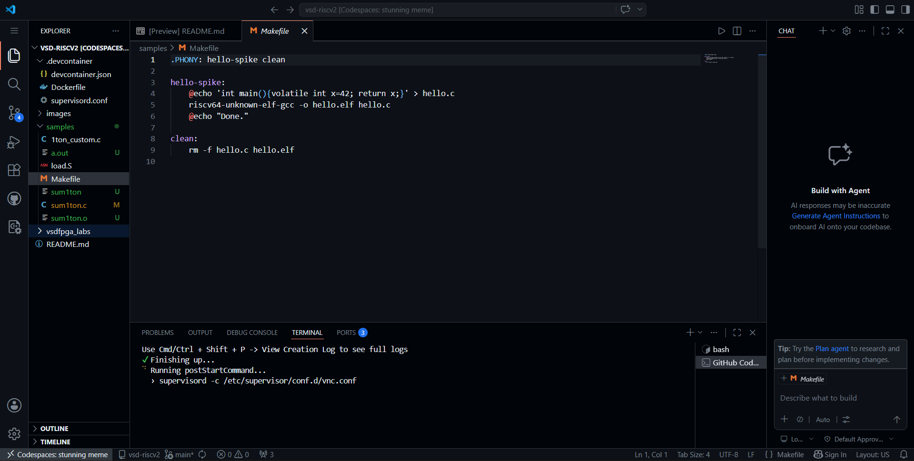
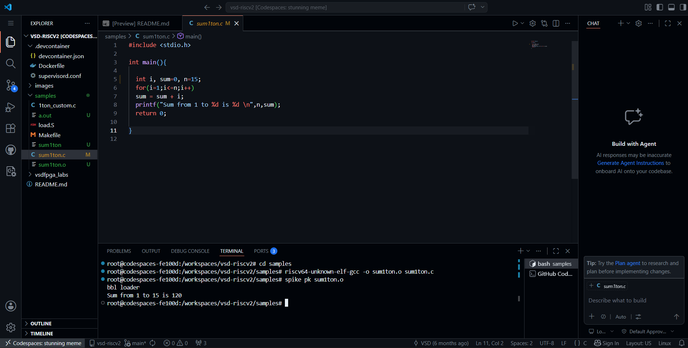
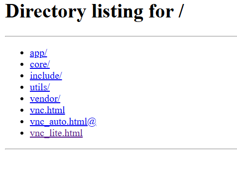
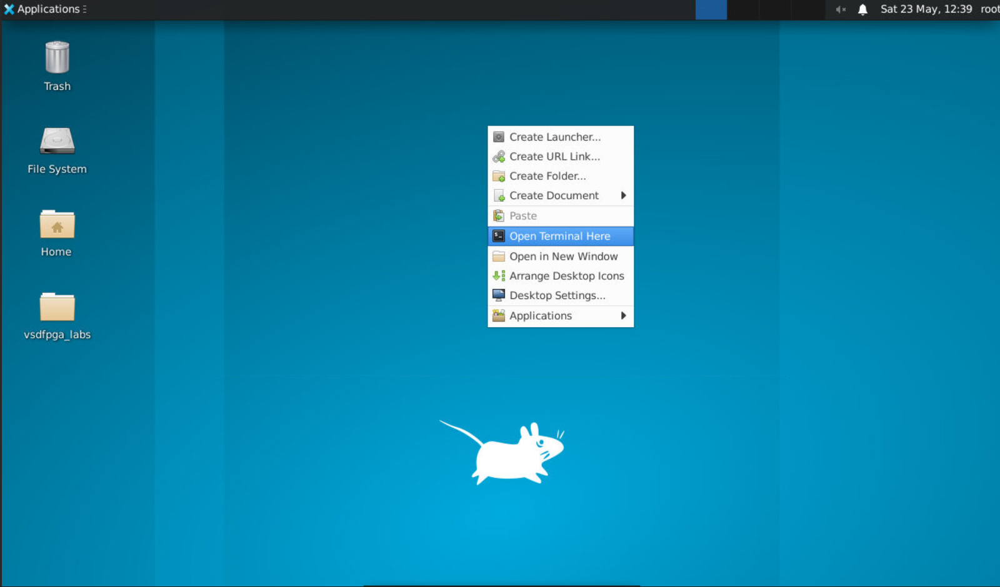
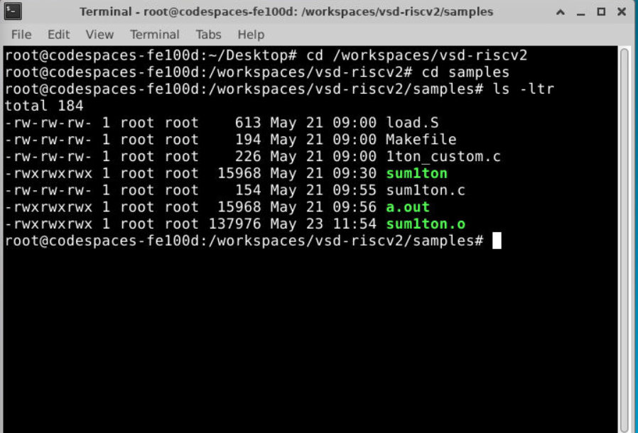
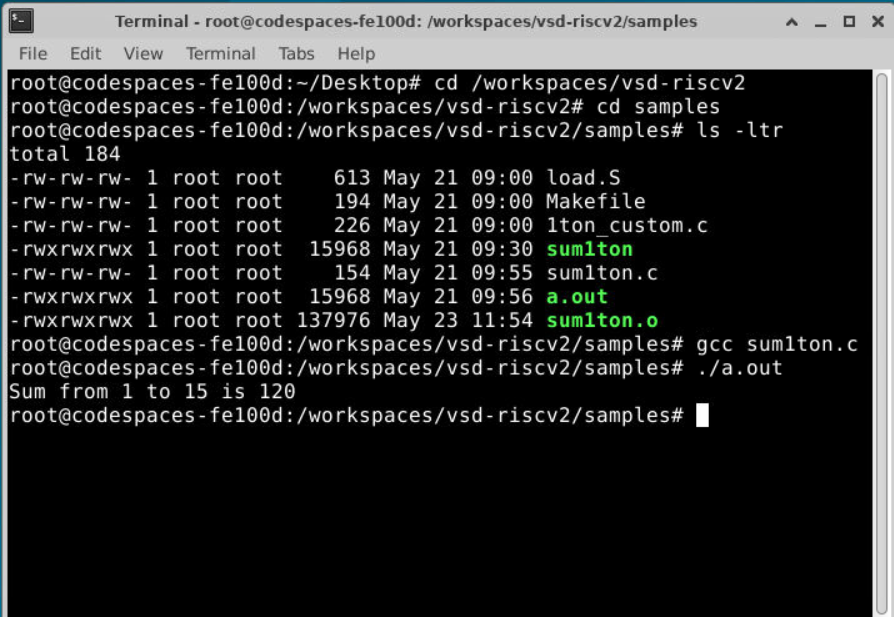
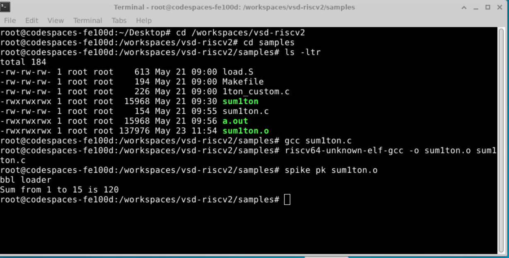

# Task-1: Environment Setup & RISC-V Reference Bring-Up

## Objective
- Ensure toolchain readiness
- Verify a working RISC-V reference execution
- Understand the RISC-V software execution flow
- Prepare for upcoming FPGA and IP development work

## Environment Used
- GitHub Codespace
- Oracle VirtualBox

---

## Step 1: GitHub Codespace Setup
### Repository Used
```bash
https://github.com/vsdip/vsd-riscv2
```
-Forked the vsd-riscv2 repository <br>
-Click on the green Code Button <br>
-Make new Codespace (first time may take 10-15 min.)


---

## Step 2: Verify RISC-V Reference Flow 
### 1. Verify the Setup
#### Inside the vsd-riscv2 Codespace:(Follow the README instructions)

In Terminal
```bash
riscv64-unknown-elf-gcc --version
spike --version #If not working then use: spike --help
iverilog -V
```
This will give version information for each tool.

### 2. Run Your First Program
Go to the samples folder
```bash
cd workspaces/vsd-riscv2/samples
```
Compile the program:

   ```bash
   riscv64-unknown-elf-gcc -o sum1ton.o sum1ton.c
   ```
Run it with Spike:

   ```bash
   spike pk sum1ton.o
   ```
Expected output:

```text
Sum from 1 to 9 is 45
```


### 3. Working with GUI Desktop (noVNC)
-In codespace go to ports tab <br>
-Click on link noVNC Desktop (6080)


#### Click **`vnc_lite.html`**


### 4. Navigate to the Sample Programs
Right-click anywhere on the desktop background <br>
Select Open Terminal Here


In the terminal, go to the workspace and then to the `samples` folder:

```bash
cd /workspaces/vsd-riscv2
cd samples
ls -ltr
```


### 5. Compile and Run Using Native GCC
-Use the gcc compiler for C program


### 6. Compile and Run Using RISC-V GCC and Spike
ompile the same program for RISC-V and run it on the Spike ISA simulator:

```bash
riscv64-unknown-elf-gcc -o sum1ton.o sum1ton.c
spike pk sum1ton.o
```


### 6. Edit the C Program Using gedit (GUI Editor)

To edit the program using a graphical editor:

```bash
gedit sum1ton.c &
```

now we can chage the code as per our requirement like change the limit instead of 9 to 15
---
## Step 3: Run sum1ton.c Program

```bash
gcc -o sum1ton sum1ton.c
./sum1ton
```

**Expected Output:**
