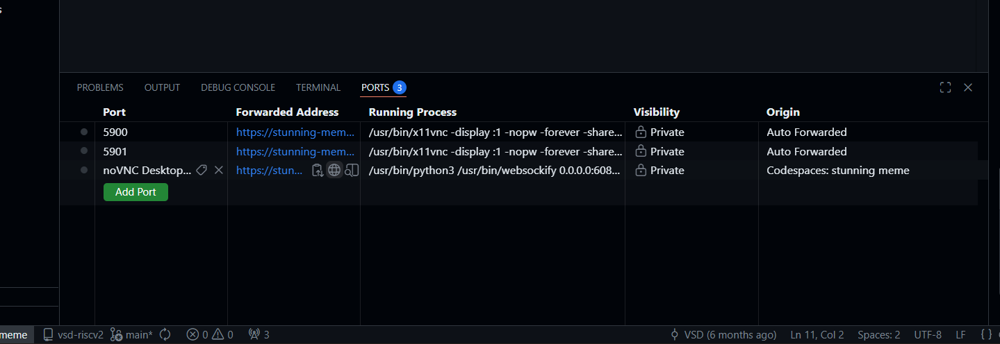
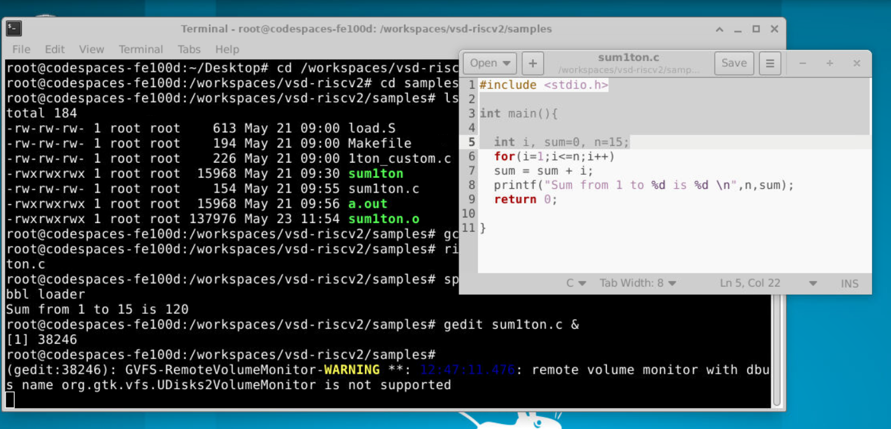
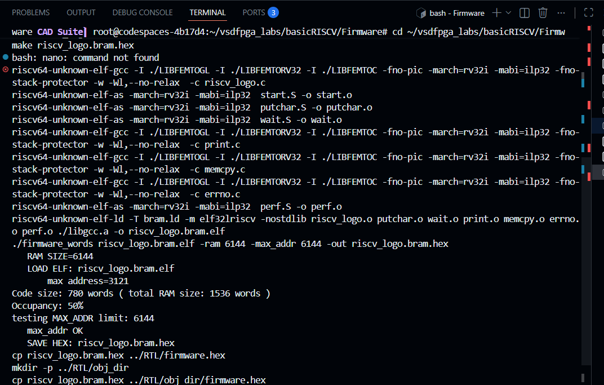
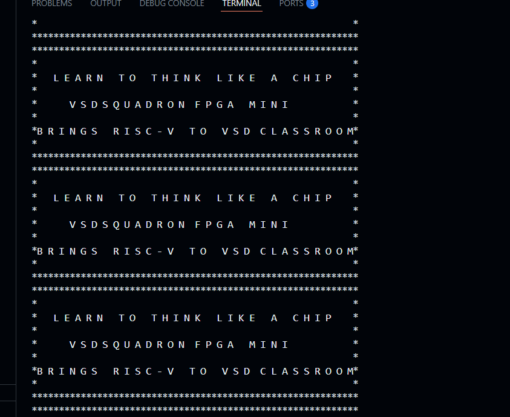
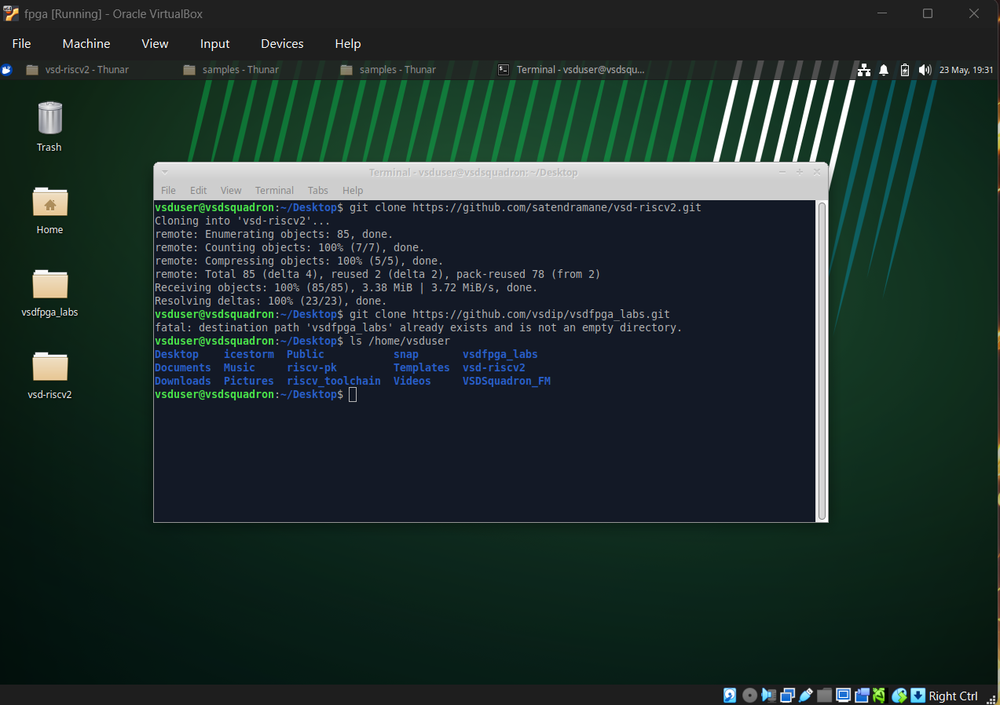
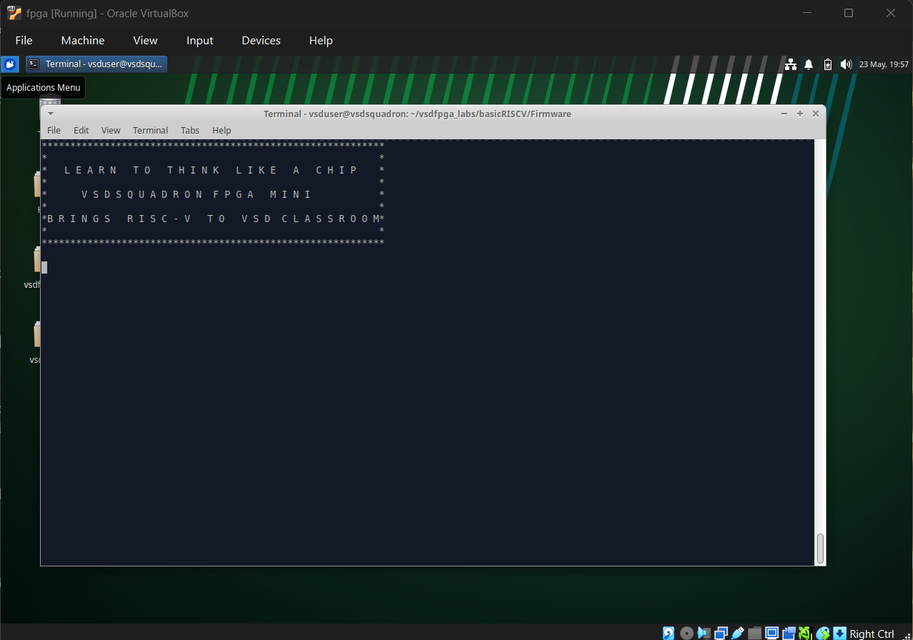

# Task-1: Environment Setup & RISC-V Reference Bring-Up

## Objective
- Ensure toolchain readiness
- Verify a working RISC-V reference execution
- Understand the RISC-V software execution flow
- Prepare for upcoming FPGA and IP development work

## Environment Used
- GitHub Codespace
- Oracle VirtualBox

---

## Step 1: GitHub Codespace Setup
### Repository Used
```bash
https://github.com/vsdip/vsd-riscv2
```
-Forked the vsd-riscv2 repository <br>
-Click on the green Code Button <br>
-Make new Codespace (first time may take 10-15 min.)


---

## Step 2: Verify RISC-V Reference Flow 
### 1. Verify the Setup
#### Inside the vsd-riscv2 Codespace:(Follow the README instructions)

In Terminal
```bash
riscv64-unknown-elf-gcc --version
spike --version #If not working then use: spike --help
iverilog -V
```
This will give version information for each tool.

### 2. Run Your First Program
Go to the samples folder
```bash
cd workspaces/vsd-riscv2/samples
```
Compile the program:

   ```bash
   riscv64-unknown-elf-gcc -o sum1ton.o sum1ton.c
   ```
Run it with Spike:

   ```bash
   spike pk sum1ton.o
   ```
Expected output:

```text
Sum from 1 to 9 is 45
```


### 3. Working with GUI Desktop (noVNC)
-In codespace go to ports tab <br>
-Click on link noVNC Desktop (6080)


#### Click **`vnc_lite.html`**


### 4. Navigate to the Sample Programs
Right-click anywhere on the desktop background <br>
Select Open Terminal Here


In the terminal, go to the workspace and then to the `samples` folder:

```bash
cd /workspaces/vsd-riscv2
cd samples
ls -ltr
```


### 5. Compile and Run Using Native GCC
-Use the gcc compiler for C program


### 6. Compile and Run Using RISC-V GCC and Spike
ompile the same program for RISC-V and run it on the Spike ISA simulator:

```bash
riscv64-unknown-elf-gcc -o sum1ton.o sum1ton.c
spike pk sum1ton.o
```


### 6. Edit the C Program Using gedit (GUI Editor)

To edit the program using a graphical editor:

```bash
gedit sum1ton.c &
```


Now, we can modify the code according to our requirements, such as changing the limit from 9 to 15.
---
## Step 3: Clone and Run VSDFPGA Labs 
clone the FPGA labs repository inside the same Codespace:

```bash
git clone https://github.com/vsdip/vsdfpga_labs.git
cd vsdfpga_labs
```
Follow the README instructions in vsdfpga_labs

Install the following tools before proceeding:

###### General dependencies

```
sudo apt-get install git vim autoconf automake autotools-dev curl libmpc-dev \
libmpfr-dev libgmp-dev gawk build-essential bison flex texinfo gperf libtool \
patchutils bc zlib1g-dev libexpat1-dev gtkwave picocom -y
```


###### FPGA toolchain (Yosys/NextPNR/IceStorm)
```
sudo apt-get install yosys nextpnr-ice40 icestorm iverilog -y
```
###### RISC-V Toolchain (GCC 8.3.0)

```
cd ~
mkdir -p riscv_toolchain && cd riscv_toolchain
wget "https://static.dev.sifive.com/dev-tools/riscv64-unknown-elf-gcc-8.3.0-2019.08.0-x86_64-linux-ubuntu14.tar.gz"
tar -xvzf riscv64-unknown-elf-gcc-*.tar.gz
echo 'export PATH=$HOME/riscv_toolchain/riscv64-unknown-elf-gcc-8.3.0-2019.08.0-x86_64-linux-ubuntu14/bin:$PATH' >> ~/.bashrc
source ~/.bashrc
```
### Building & Running

Building the file

```
git clone https://github.com/vsdip/vsdfpga_labs.git
cd vsdfpga_labs/basicRISCV/Firmware
nano riscv_logo.c
make riscv_logo.bram.hex
```


Compiling and Running the file

```
riscv64-unknown-elf-gcc -o riscv_logo riscv_logo.c
spike pk riscv_logo
```


## Step 4: Local Machine Preparation 
Clone both repositories locally: <br>
vsd-riscv2 <br>
vsdfpga_labs

```bash
git clone https://github.com/vsdip/vsdfpga_labs.git
cd vsdfpga_labs
```



---
## Understanding Check

### Q1. Where is the RISC-V program located in the vsd-riscv2 repository?
The specific file is:
```bash
workspaces/vsd-riscv2/samples/sum1ton.c
```

### Q2. How is the program compiled and loaded into memory?

The program is compiled using the RISC-V toolchain command:

```
riscv64-unknown-elf-gcc -o sum1ton.o sum1ton.c
```
This makes a RISC-V executable (ELF format) file.
Then it is loaded into memory using spike with this command:

```
spike pk sum1ton.o
```

This makes pk (proxy kernel) load our ELF file and set it up into memory. Then it executes it

### Q3. How does the RISC-V core access memory and memory-mapped IO?

The RISC-V core accesses both memory and memory-mapped IO using load and store instructions over a common system bus. Specific address ranges are assigned to hardware devices, so when the core reads or writes to those addresses, it communicates with peripherals as if they were normal memory locations.

### Q4. Where would a new FPGA IP block logically integrate in this system?

A new FPGA IP block would connect to the system bus and be mapped to a unique address range within the memory map. This allows the RISC-V core to interact with the IP block through standard memory-mapped read and write operations, just like other peripherals.
