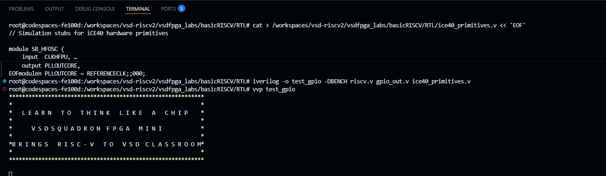
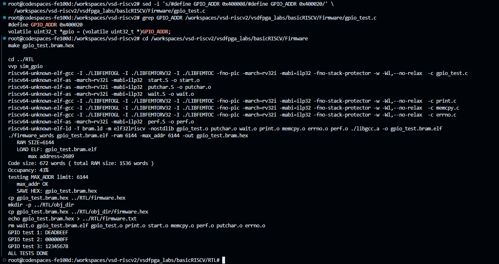

# Task-2: Design & Integrate Your First Memory-Mapped IP

## Objective
Design a 32-bit memory-mapped GPIO Output IP and integrate it into the FemtoRV32 RISC-V SoC. The CPU writes any 32-bit value to the GPIO register via a memory address and reads it back — validated through simulation.

---

## Repository Structure
```
├── RTL/
│   ├── gpio_out.v            # New GPIO IP module (created)
│   ├── riscv.v               # SoC top-level (modified to add GPIO)
│   └── ice40_primitives.v    # Simulation stubs for iCE40 primitives
├── Firmware/
│   └── gpio_test.c           # C test program for GPIO validation
└── README.md
```

---

## Address Map

| Bit | Peripheral   | Byte Address | Operation    |
|-----|-------------|--------------|--------------|
| 0   | LEDs        | 0x400000     | Write only   |
| 1   | UART data   | 0x400004     | Write        |
| 2   | UART status | 0x400008     | Read         |
| **3** | **GPIO**  | **0x40000C** | **Read/Write** |

> Address decoding: `mem_addr[22] = 1` → IO space · `mem_wordaddr[3] = 1` → GPIO selected

---

## Step 1: SoC Understanding

### RTL Files
| File | Purpose | Modified? |
|------|---------|-----------|
| `riscv.v` | Main SoC — CPU, RAM, IO decoder, LED, UART | YES |
| `emitter_uart.v` | UART serial transmitter | No |
| `clockworks.v` | Clock divider + safe reset | No |
| `femtopll.v` | PLL clock generator (iCE40) | No |
| `gpio_out.v` | New GPIO IP module | Created |
| `ice40_primitives.v` | Simulation stubs | Created |

### Key Finding — Address Decoder
```verilog
wire isIO  = mem_addr[22];   // bit 22 = 1 → peripheral
wire isRAM = !isIO;          // bit 22 = 0 → RAM
```

### CPU Write Pattern (existing LED example)
```verilog
always @(posedge clk) begin
   if(isIO & mem_wstrb & mem_wordaddr[IO_LEDS_bit])
      LEDS <= mem_wdata;
end
```

### Readback Mux Pattern
```verilog
assign mem_rdata = isRAM ? RAM_rdata : IO_rdata;
```

---

## Step 2: GPIO IP — gpio_out.v

```verilog
module gpio_out (
    input  wire        clk,        // system clock
    input  wire        rst,        // active-high reset
    input  wire        valid,      // isIO & mem_wordaddr[IO_GPIO_bit]
    input  wire        we,         // write enable (mem_wstrb)
    input  wire [31:0] wdata,      // data from CPU
    output reg  [31:0] rdata,      // data back to CPU
    output wire [31:0] gpio_out    // GPIO output signal
);

    reg [31:0] gpio_reg;

    // Write logic
    always @(posedge clk) begin
        if (rst)
            gpio_reg <= 32'h00000000;
        else if (valid && we)
            gpio_reg <= wdata;
    end

    // Readback logic
    always @(*) begin
        rdata = gpio_reg;
    end

    assign gpio_out = gpio_reg;

endmodule
```

---

## Step 3: SoC Integration — riscv.v

### Change 1 — Add GPIO address constant
```verilog
localparam IO_GPIO_bit = 3;   // bit 3 → GPIO register (read/write)
```

### Change 2 — Instantiate GPIO module (after UART instance)
```verilog
wire [31:0] gpio_rdata;
wire [31:0] gpio_pins;

gpio_out GPIO(
   .clk(clk),
   .rst(!resetn),
   .valid(isIO & mem_wordaddr[IO_GPIO_bit]),  // address-specific select
   .we(mem_wstrb),
   .wdata(mem_wdata),
   .rdata(gpio_rdata),
   .gpio_out(gpio_pins)
);
```

### Change 3 — Update readback mux
```verilog
wire [31:0] IO_rdata =
    mem_wordaddr[IO_UART_CNTL_bit] ? {22'b0, !uart_ready, 9'b0} :
    mem_wordaddr[IO_GPIO_bit]      ? gpio_rdata                  :
                                     32'b0;
```

> **Important fix:** `valid` must be `isIO & mem_wordaddr[IO_GPIO_bit]` — NOT just `isIO`. Using only `isIO` caused GPIO to fire on every IO access including UART writes, overwriting the register with wrong data.

---

## Step 4: Firmware & Simulation



### gpio_test.c
```c
#include <stdio.h>
#include <stdint.h>

#define GPIO_ADDR 0x400008
volatile uint32_t *gpio = (volatile uint32_t *)GPIO_ADDR;

void main() {
    *gpio = 0xDEADBEEF;
    printf("GPIO test 1: %x\n", (unsigned int)*gpio);

    *gpio = 0x000000FF;
    printf("GPIO test 2: %x\n", (unsigned int)*gpio);

    *gpio = 0x12345678;
    printf("GPIO test 3: %x\n", (unsigned int)*gpio);

    printf("ALL TESTS DONE\n");
}
```

### Compile
```bash
cd Firmware
make gpio_test.bram.hex
```
Output: Code size: 672 words (43% of 1536 words RAM) 

### Simulate
```bash
cd RTL
iverilog -o sim_gpio -DBENCH riscv.v gpio_out.v ice40_primitives.v
vvp sim_gpio
```

### Simulation Results
| Test | Value Written | Readback | Result |
|------|--------------|----------|--------|
| Test 1 | `0xDEADBEEF` | `deadbeef` |  PASS |
| Test 2 | `0x000000FF` | `ff` |  PASS |
| Test 3 | `0x12345678` | `12345678` |  PASS |


---

##  Understanding Questions

**Q: What is a memory-mapped peripheral?**  
A peripheral that appears to the CPU as a memory address. The CPU reads and writes it using normal load/store instructions — no special instructions needed.

**Q: How does the CPU select GPIO vs UART?**  
The address decoder checks `mem_addr[22]` for IO space, then `mem_wordaddr[3]` for GPIO vs `mem_wordaddr[1]` for UART. Only one bit is high at a time.

**Q: What address does GPIO use?**  
Byte address `0x400008`. Bit 22 = 1 (IO space). Word address bit 3 = 1 (GPIO selected).

**Q: Why was `valid = isIO` wrong?**  
`isIO` is true for ALL IO accesses including UART. The GPIO captured UART data and overwrote the register. Fix: `isIO & mem_wordaddr[IO_GPIO_bit]`.

**Q: What did simulation prove?**  
The CPU can write any 32-bit value to the GPIO register and read it back correctly. All 3 test patterns matched exactly.

---

##  Tools Used

| Tool | Purpose |
|------|---------|
| GitHub Codespaces | Cloud development environment |
| OSS CAD Suite | Pre-installed RISC-V + FPGA toolchain |
| riscv64-unknown-elf-gcc | RISC-V C compiler |
| Icarus Verilog (iverilog/vvp) | Verilog simulation |
| vsdfpga_labs | Base SoC and firmware |
