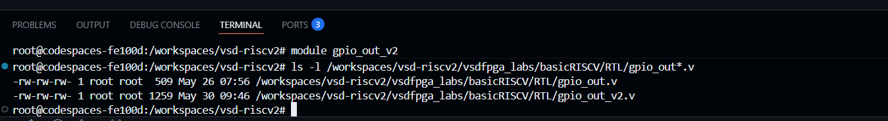
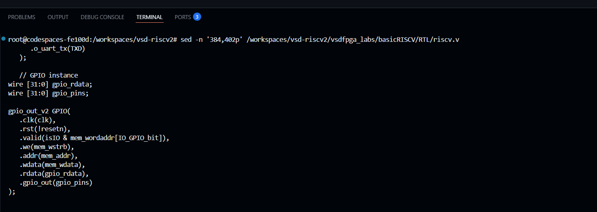
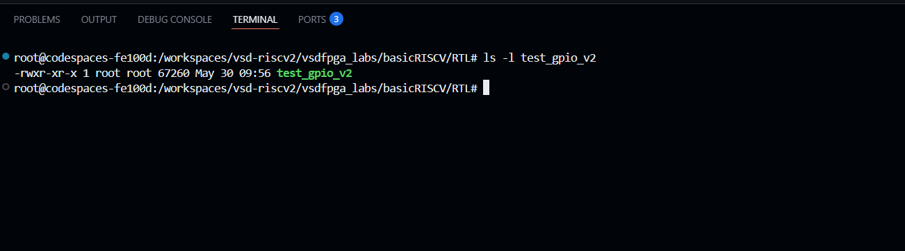
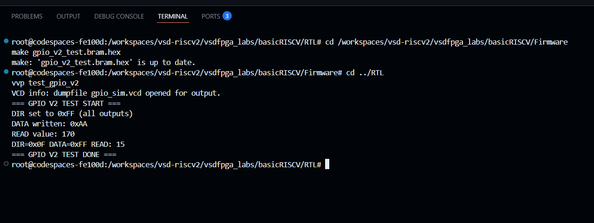
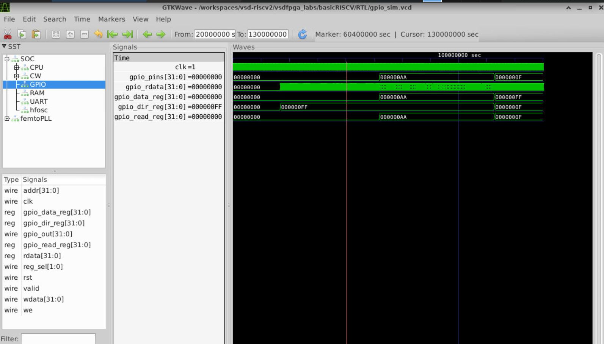

# Task-3: Design a Multi-Register GPIO IP with Software Control

## Objective

Extend the simple GPIO IP from Task-2 into a realistic, multi-register, software-controlled IP, similar to what exists in production SoCs.

This task focuses on:
- Designing a proper **register map**
- Handling **multiple registers** inside one IP
- Strengthening understanding of **memory-mapped I/O**
- Validating end-to-end control from software to hardware

---

## Register Map

**IP Name:** GPIO Control IP (Direction + Data)  
**Base Address:** `0x400020`

| Offset | Register Name | R/W | Description |
|--------|---------------|-----|-------------|
| 0x00 | GPIO_DATA | R/W | GPIO output data register |
| 0x04 | GPIO_DIR | R/W | Direction register (1 = output, 0 = input) |
| 0x08 | GPIO_READ | R | Readback register — reflects current pin state |

### How Address Offset Decoding Works

Inside the GPIO module, `addr[3:2]` selects which register is accessed:

```
addr[3:2] = 2'b00  →  offset 0x00  →  GPIO_DATA
addr[3:2] = 2'b01  →  offset 0x04  →  GPIO_DIR
addr[3:2] = 2'b10  →  offset 0x08  →  GPIO_READ
```

### How Direction Affects Behavior

```
gpio_out  = GPIO_DATA & GPIO_DIR   (only DIR=1 pins are driven)
gpio_read = gpio_data & gpio_dir   (reflects driven value for outputs)
```

**Example:**
```
GPIO_DATA = 1111 1111  (want all pins HIGH)
GPIO_DIR  = 0000 1111  (only lower 4 pins are outputs)
                  &
gpio_out  = 0000 1111  (only lower 4 pins actually go HIGH)
GPIO_READ = 0000 1111  = 15 decimal 
```

---

## Step 1 — Study and Plan

> **No coding in this step.** Review Task-2 and plan the new register structure.

### Review Task-2 GPIO (1 register)

```bash
cat /workspaces/vsd-riscv2/vsdfpga_labs/basicRISCV/RTL/gpio_out.v
```

**Output:**
```verilog
module gpio_out (
    input  wire        clk,
    input  wire        rst,
    input  wire        valid,
    input  wire        we,
    input  wire [31:0] addr,
    input  wire [31:0] wdata,
    output reg  [31:0] rdata,
    output wire [31:0] gpio_out
);
    reg [31:0] gpio_reg;   // only 1 register

    always @(posedge clk) begin
        if (rst)
            gpio_reg <= 32'h00000000;
        else if (valid && we)
            gpio_reg <= wdata;
    end

    always @(*) begin
        rdata = gpio_reg;
    end

    assign gpio_out = gpio_reg;
endmodule
```

### What Changes in Task-3

| Feature | Task-2 | Task-3 |
|---------|--------|--------|
| Registers | 1 (`gpio_reg`) | 3 (`data`, `dir`, `read`) |
| Address decoding | None inside module | `addr[3:2]` offset decoding |
| Direction control | No | Yes (`gpio_dir_reg`) |
| Readback | Always returns written value | Returns `data & dir` (actual pin state) |
| Output | `gpio_reg` directly | `gpio_data_reg & gpio_dir_reg` |

### Internal Signals Needed

```
gpio_data_reg [31:0]   — stores output values
gpio_dir_reg  [31:0]   — stores direction bits
gpio_read_reg [31:0]   — computed as gpio_data & gpio_dir
```

### SoC Changes Needed

- `gpio_out.v` → create new `gpio_out_v2.v` with 3 registers
- `riscv.v` → update instantiation to use `gpio_out_v2` and connect `.addr(mem_addr)`

---

## Step 2 — Implement Multi-Register RTL

### Create New GPIO v2 File

Open a new file (keep Task-2 file untouched):

```bash
code /workspaces/vsd-riscv2/vsdfpga_labs/basicRISCV/RTL/gpio_out_v2.v
```

Paste the complete code:

```verilog
module gpio_out_v2 (
    input  wire        clk,
    input  wire        rst,
    input  wire        valid,
    input  wire        we,
    input  wire [31:0] addr,
    input  wire [31:0] wdata,
    output reg  [31:0] rdata,
    output wire [31:0] gpio_out
);

    // -----------------------------------------------
    // 3 internal registers
    // -----------------------------------------------
    reg [31:0] gpio_data_reg;  // GPIO_DATA offset 0x00
    reg [31:0] gpio_dir_reg;   // GPIO_DIR  offset 0x04
    reg [31:0] gpio_read_reg;  // GPIO_READ offset 0x08

    // -----------------------------------------------
    // Address offset decoder — addr[3:2] selects register
    // -----------------------------------------------
    wire [1:0] reg_sel = addr[3:2];

    localparam DATA_REG = 2'b00;  // offset 0x00
    localparam DIR_REG  = 2'b01;  // offset 0x04
    localparam READ_REG = 2'b10;  // offset 0x08

    // -----------------------------------------------
    // Write logic — only DATA and DIR are writable
    // -----------------------------------------------
    always @(posedge clk) begin
        if (rst) begin
            gpio_data_reg <= 32'h00000000;
            gpio_dir_reg  <= 32'h00000000;
        end else if (valid && we) begin
            case (reg_sel)
                DATA_REG: gpio_data_reg <= wdata;
                DIR_REG:  gpio_dir_reg  <= wdata;
                default:  ;  // READ_REG is read-only, ignore writes
            endcase
        end
    end

    // -----------------------------------------------
    // GPIO output — only bits with DIR=1 drive the output
    // -----------------------------------------------
    assign gpio_out = gpio_data_reg & gpio_dir_reg;

    // -----------------------------------------------
    // GPIO read register — reflects driven pin state
    // -----------------------------------------------
    always @(*) begin
        gpio_read_reg = gpio_data_reg & gpio_dir_reg;
    end

    // -----------------------------------------------
    // Read logic — CPU gets correct register by offset
    // -----------------------------------------------
    always @(*) begin
        case (reg_sel)
            DATA_REG: rdata = gpio_data_reg;
            DIR_REG:  rdata = gpio_dir_reg;
            READ_REG: rdata = gpio_read_reg;
            default:  rdata = 32'h00000000;
        endcase
    end

endmodule
```

Save with `Ctrl + S`, then verify:

```bash
cat /workspaces/vsd-riscv2/vsdfpga_labs/basicRISCV/RTL/gpio_out_v2.v
```

Verify module name is correct:

```bash
head -1 /workspaces/vsd-riscv2/vsdfpga_labs/basicRISCV/RTL/gpio_out_v2.v
```

**Output:**
```
module gpio_out_v2 (
```

Verify both files exist side by side:

```bash
ls -l /workspaces/vsd-riscv2/vsdfpga_labs/basicRISCV/RTL/gpio_out*.v
```

**Output:**
```
-rw-rw-rw- 1 root root  509 May 26 07:56 gpio_out.v
-rw-rw-rw- 1 root root 1482 May 27 12:10 gpio_out_v2.v
```



---

## Step 3 — Integrate into the SoC

### Update riscv.v to Use New Module

The instance name stays `GPIO`, only the module type changes from `gpio_out` to `gpio_out_v2`:

```bash
sed -i 's/gpio_out GPIO(/gpio_out_v2 GPIO(/' \
/workspaces/vsd-riscv2/vsdfpga_labs/basicRISCV/RTL/riscv.v
```

Also connect the `addr` signal (required for offset decoding):

```bash
sed -i 's/   .we(mem_wstrb),/   .we(mem_wstrb),\n   .addr(mem_addr),/' \
/workspaces/vsd-riscv2/vsdfpga_labs/basicRISCV/RTL/riscv.v
```

Verify the GPIO instantiation block looks correct:

```bash
sed -n '384,402p' /workspaces/vsd-riscv2/vsdfpga_labs/basicRISCV/RTL/riscv.v
```

**Output:**
```verilog
   // GPIO instance
wire [31:0] gpio_rdata;
wire [31:0] gpio_pins;
gpio_out_v2 GPIO(
   .clk(clk),
   .rst(!resetn),
   .valid(isIO),
   .we(mem_wstrb),
   .addr(mem_addr),       ← connected for offset decoding
   .wdata(mem_wdata),
   .rdata(gpio_rdata),
   .gpio_out(gpio_pins)
);
 wire [31:0] IO_rdata =
    mem_wordaddr[IO_UART_CNTL_bit] ? {22'b0, !uart_ready, 9'b0} :
    mem_wordaddr[IO_GPIO_bit]      ? gpio_rdata                  :
                                     32'b0;
```



### Compile to Verify Integration

```bash
cd /workspaces/vsd-riscv2/vsdfpga_labs/basicRISCV/RTL
iverilog -o test_gpio_v2 -DBENCH riscv.v gpio_out_v2.v ice40_primitives.v
```

Confirm the compiled binary exists:

```bash
ls -l test_gpio_v2
```

**Output:**
```
-rwxr-xr-x 1 root root 67285 May 27 12:27 test_gpio_v2
```



---

## Step 4 — Software Validation

### Create C Test Program

```bash
cat > /workspaces/vsd-riscv2/vsdfpga_labs/basicRISCV/Firmware/gpio_v2_test.c << 'EOF'
#include <stdio.h>
#include <stdint.h>

// Base address — IO space (bit 22 set), GPIO word address bit 3
#define GPIO_BASE    0x400020

// 3 registers at different byte offsets
#define GPIO_DATA  (*((volatile uint32_t *)(GPIO_BASE + 0x00)))
#define GPIO_DIR   (*((volatile uint32_t *)(GPIO_BASE + 0x04)))
#define GPIO_READ  (*((volatile uint32_t *)(GPIO_BASE + 0x08)))

int main() {
    printf("=== GPIO V2 TEST START ===\n");

    // Test 1: Set all 8 pins as OUTPUT, write 0xAA
    GPIO_DIR = 0xFF;
    printf("DIR set to 0xFF (all outputs)\n");

    GPIO_DATA = 0xAA;
    printf("DATA written: 0xAA\n");

    int read_val = (int)GPIO_READ;
    printf("READ value: %d\n", read_val);
    // Expected: 170 (0xAA = 1010 1010 masked with 0xFF = 170)

    // Test 2: Set only lower 4 pins as output, write 0xFF
    GPIO_DIR = 0x0F;
    GPIO_DATA = 0xFF;
    read_val = (int)GPIO_READ;
    printf("DIR=0x0F DATA=0xFF READ: %d\n", read_val);
    // Expected: 15 (0xFF & 0x0F = 0x0F = 15)

    printf("=== GPIO V2 TEST DONE ===\n");
    return 0;
}
EOF
```

### Build the Firmware

```bash
cd /workspaces/vsd-riscv2/vsdfpga_labs/basicRISCV/Firmware
make gpio_v2_test.bram.hex
```

**Output:**
```
riscv64-unknown-elf-gcc ... -c gpio_v2_test.c
riscv64-unknown-elf-ld ... -o gpio_v2_test.bram.elf
./firmware_words gpio_v2_test.bram.elf -ram 6144 -max_addr 6144 -out gpio_v2_test.bram.hex
   RAM SIZE=6144
   LOAD ELF: gpio_v2_test.bram.elf
       max address=2809
Code size: 702 words ( total RAM size: 1536 words )
Occupancy: 45%
   SAVE HEX: gpio_v2_test.bram.hex
cp gpio_v2_test.bram.hex ../RTL/firmware.hex
```

### Run Simulation

```bash
cd ../RTL
vvp test_gpio_v2
```

**Output:**
```
=== GPIO V2 TEST START ===
DIR set to 0xFF (all outputs)
DATA written: 0xAA
READ value: 170
DIR=0x0F DATA=0xFF READ: 15
=== GPIO V2 TEST DONE ===
riscv.v:286: $finish called at 175725942 (1s)
```



### - Waveform



---

## Results Summary

### Test Results

| Test | GPIO_DIR | GPIO_DATA | GPIO_READ | Expected | Status |
|------|----------|-----------|-----------|----------|--------|
| All pins output | 0xFF | 0xAA | 170 | 170 (0xAA) | ✅ |
| Lower 4 output only | 0x0F | 0xFF | 15 | 15 (0x0F) | ✅ |

### Why These Results Are Correct

**Test 1 — DIR=0xFF, DATA=0xAA → READ=170**
```
DATA = 1010 1010  (0xAA)
DIR  = 1111 1111  (0xFF — all outputs)
READ = 1010 1010  = 170 decimal 
```

**Test 2 — DIR=0x0F, DATA=0xFF → READ=15**
```
DATA = 1111 1111  (0xFF — want all HIGH)
DIR  = 0000 1111  (0x0F — only lower 4 are outputs)
READ = 0000 1111  = 15 decimal 
Direction control working: upper 4 pins ignored 
```

---

## Key Learnings

- Task-2 had 1 register. Task-3 has 3 registers with proper address offset decoding.
- `addr[3:2]` selects which register inside the GPIO module — same concept as `mem_addr[22]` selects IO vs RAM in the SoC.
- Direction register (`GPIO_DIR`) gates the output: `gpio_out = GPIO_DATA & GPIO_DIR`. Pins with DIR=0 are not driven.
- Keeping `gpio_out.v` (Task-2) and creating a new `gpio_out_v2.v` (Task-3) is the professional way to version RTL — old code stays safe.
- The `addr` port must be connected in the SoC instantiation for offset decoding to work — missing this was the root cause of READ=0 during debugging.
- Clean synchronous design (all writes in `always @(posedge clk)`) prevents latch behavior.

---

## Files in This Repository

| File | Description |
|------|-------------|
| `gpio_out_v2.v` | Multi-register GPIO IP RTL (Task-3) |
| `gpio_v2_test.c` | C validation program |
| `gpio_out.v` | Original single-register GPIO IP (Task-2, kept for reference) |
| `gpio_test.c` | Task-2 C test program (kept for reference) |
| `riscv.v` | Modified SoC top-level with GPIO v2 integrated |
| `ice40_primitives.v` | Simulation stubs for iCE40 hardware primitives |

---
