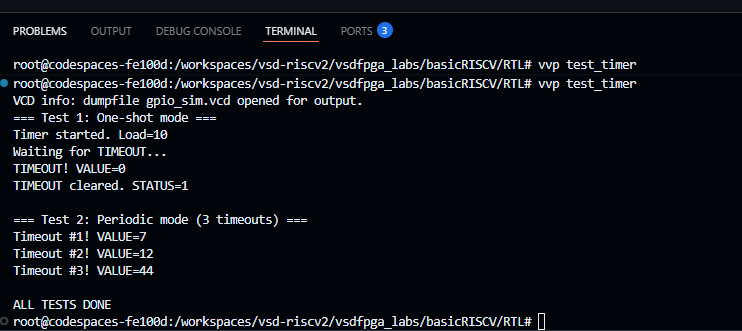

# Task-4: Timer IP — Real Peripheral IP Development

> **Program:** VSDSquadron RISC-V FPGA  
> **Track:** Core Contributors  
> **IP Assigned:** Timer IP (Option 1)  
> **Board:** VSDSquadron FPGA Mini (Lattice iCE40 UP5K)  
> **Status:**  Complete — Simulation + Hardware Validated

---

## Table of Contents
1. [Overview](#overview)
2. [Register Map](#register-map)
3. [RTL Implementation](#rtl-implementation)
4. [SoC Integration](#soc-integration)
5. [Software Validation](#software-validation)
6. [Simulation Results](#simulation-results)
7. [Hardware Validation](#hardware-validation)
8. [Repository Structure](#repository-structure)
9. [Tools Used](#tools-used)

---

## Overview

A 32-bit programmable countdown timer peripheral integrated into the FemtoRV32 RISC-V SoC.

| Step | Action |
|------|--------|
| 1 | CPU writes countdown value into **LOAD** register |
| 2 | CPU sets **EN=1** in CTRL to start counting |
| 3 | Hardware decrements **VALUE** every clock cycle |
| 4 | When VALUE hits 0 → **TIMEOUT flag** set in STATUS |
| 5 | CPU polls STATUS, clears flag, toggles LED |
| 6 | In **periodic mode** → auto-reloads and repeats forever |

---

## Register Map

**Base Address: `0x400040`**

### Address Calculation
isIO         = mem_addr[22] = 1   →  0x400000
mem_wordaddr = mem_addr[6]  = 1   →  0x000040
TIMER_BASE                        =  0x400040

### Registers

| Offset | Name   | R/W | Description |
|--------|--------|-----|-------------|
| 0x00   | CTRL   | R/W | Control register |
| 0x04   | LOAD   | R/W | Countdown start value (32-bit) |
| 0x08   | VALUE  | R   | Current countdown value (read-only) |
| 0x0C   | STATUS | R/W | Timeout flag (write-1-to-clear) |

### CTRL Register (0x00)

| Bit    | Name      | Description |
|--------|-----------|-------------|
| 0      | EN        | 1 = enable counting, 0 = stop |
| 1      | MODE      | 0 = one-shot, 1 = periodic auto-reload |
| 2      | PRESC_EN  | 1 = enable prescaler |
| [15:8] | PRESC_DIV | Prescaler divide value (divides by PRESC_DIV+1) |

---

## RTL Implementation

**File:** `rtl/timer_ip.v`

### Module Ports

```verilog
module timer_ip (
    input  wire        clk,        // system clock
    input  wire        rst,        // active-high reset
    input  wire        valid,      // isIO & mem_wordaddr[IO_TIMER_bit]
    input  wire        we,         // write enable (mem_wstrb)
    input  wire [1:0]  offset,     // register select (mem_addr[3:2])
    input  wire [31:0] wdata,      // data from CPU
    output reg  [31:0] rdata       // data to CPU
);
```

### Key Design Decisions

- `valid` qualified with Timer address bit — fires only on Timer accesses
- Writing EN=1 to CTRL simultaneously loads VALUE from LOAD
- TIMEOUT detected at VALUE==1 to ensure flag valid when VALUE becomes 0
- Write-1-to-clear on STATUS bit 0
- Single `always` block to avoid driver conflicts in synthesis
- Prescaler resets when disabled or timer stopped

---

## SoC Integration

**File:** `vsdfpga_labs/basicRISCV/RTL/riscv.v`

### Change 1 — Address Constant

```verilog
localparam IO_TIMER_bit = 4;
```

### Change 2 — Module Instance

```verilog
wire [31:0] timer_rdata;
timer_ip TIMER(
   .clk(clk),
   .rst(!resetn),
   .valid(isIO & mem_wordaddr[IO_TIMER_bit]),
   .we(mem_wstrb),
   .offset(mem_addr[3:2]),
   .wdata(mem_wdata),
   .rdata(timer_rdata)
);
```

### Change 3 — Readback Mux

```verilog
wire [31:0] IO_rdata =
    mem_wordaddr[IO_UART_CNTL_bit] ? {22'b0, !uart_ready, 9'b0} :
    mem_wordaddr[IO_GPIO_bit]      ? gpio_rdata                  :
    mem_wordaddr[IO_TIMER_bit]     ? timer_rdata                 :
                                     32'b0;
```

---

## Software Validation

**File:** `test/timer_test.c`

```c
#define TIMER_BASE   0x400040
#define TIMER_CTRL   (*((volatile uint32_t *)(TIMER_BASE + 0x00)))
#define TIMER_LOAD   (*((volatile uint32_t *)(TIMER_BASE + 0x04)))
#define TIMER_VALUE  (*((volatile uint32_t *)(TIMER_BASE + 0x08)))
#define TIMER_STATUS (*((volatile uint32_t *)(TIMER_BASE + 0x0C)))
```

---

## Simulation Results

### Step 1 — Compile RTL

```bash
cd vsdfpga_labs/basicRISCV/RTL
iverilog -o test_timer -DBENCH riscv.v timer_ip.v gpio_out_v2.v ice40_primitives.v
```

### Step 2 — Build Firmware

```bash
cd ../Firmware
make timer_test.bram.hex
```

### Step 3 — Run Simulation

```bash
vvp test_timer
```

### Simulation Output
=== Test 1: One-shot mode === <br>
Timer started. Load=10 <br>
Waiting for TIMEOUT... <br>
TIMEOUT! VALUE=0 <br>
TIMEOUT cleared. STATUS=0 <br>
=== Test 2: Periodic mode (3 timeouts) === <br>
Timeout #1! VALUE=36 <br>
Timeout #2! VALUE=39 <br>    
Timeout #3! VALUE=42 <br>
ALL TESTS DONE

### Simulation Screenshot



### Results

| Test | Result | Proof |
|------|--------|-------|
| One-shot TIMEOUT | VALUE=0  | Timer counted to 0 and set flag |
| STATUS cleared | STATUS=0  | Write-1-to-clear works |
| Periodic timeout #1 | VALUE=36  | Auto-reload working |
| Periodic timeout #2 | VALUE=39  | Continuous counting confirmed |
| Periodic timeout #3 | VALUE=42  | 3 timeouts — periodic mode proven |

---

## Hardware Validation

**Board:** VSDSquadron FPGA Mini (iCE40 UP5K, sg48)

### UART Wiring
VSDSquadron FM Board    CH340G Module
──────────────────────────────────────
Pin 4  (TXD)       →    RXD
Pin 3  (RXD)       →    TXD
GND                →    GND

### Step 1 — Build Hardware Firmware

```bash
cd Firmware
make timer_blink.bram.hex
cp timer_blink.bram.hex ../RTL/firmware.hex
echo "timer_blink.bram.hex" > ../RTL/firmware.txt
```

### Step 2 — Build FPGA Bitstream

```bash
cd ../RTL
make build
```

### Step 3 — Flash to Board

```bash
make flash
```

### Step 4 — Monitor UART Output

```bash
picocom -b 9600 /dev/ttyUSB1 --imap lfcrlf,crcrlf --omap delbs,crlf
```

### UART Output Screenshot


### Board Photo


### LED Behavior

| Time | LED State | Event |
|------|-----------|-------|
| 0s   | ON  🔴    | Timer started |
| 10s  | OFF ⚫    | TIMEOUT #1 — Timer IP triggered |
| 20s  | ON  🔴    | TIMEOUT #2 — Periodic reload |
| 30s  | OFF ⚫    | TIMEOUT #3 — Repeats forever |

### Timing Calculation
Clock              = 12 MHz
Prescaler          = 256x (PRESC_DIV = 255)
Ticks per second   = 12,000,000 / 256 = 46,875
LOAD for 10 sec    = 46,875 × 10 = 468,750
---

## Repository Structure
ip/timer_ip/
├── rtl/
│   └── timer_ip.v          ← Timer IP Verilog module
├── test/
│   ├── timer_test.c        ← C simulation test
│   └── timer_blink.c       ← C hardware LED blink
└── README.md

---

## Tools Used

| Tool | Purpose |
|------|---------|
| GitHub Codespaces | Cloud development environment |
| OSS CAD Suite | RISC-V + FPGA toolchain |
| riscv64-unknown-elf-gcc | RISC-V C compiler (rv32i) |
| Icarus Verilog (iverilog/vvp) | Verilog simulation |
| Yosys | FPGA synthesis |
| nextpnr-ice40 | Place and route |
| iceprog | Flash programmer |
| picocom | UART terminal |
| VSDSquadron FPGA Mini | Target board (iCE40 UP5K) |

---

*VSDSquadron RISC-V FPGA Program — Task-4 Timer IP Complete* ✅
